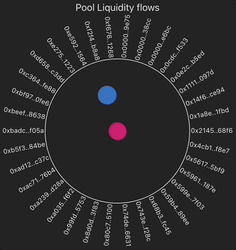
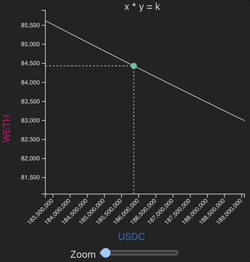

# Uniswap Animation

[ETH Tokyo](https://ethglobal.com/events/tokyo) hackathon project animating a USDC/WETH [Uniswap](https://uniswap.org/) V3 pool over time.



The flow of USDC (blue) and WETH (pink) in and out of the pool. The larger the circle the larger the liquidity transfer.

## Description

This project animates what happened to the [Uniswap V3 USDC/ETH pool with 0.3% fee](https://info.uniswap.org/#/pools/0x8ad599c3a0ff1de082011efddc58f1908eb6e6d8) over different time periods. Most DeFI analytics are static snapshots of time, eg pool reserve balances, or charts of historical prices and volumes. Using animated visuals, details like which accounts liquidity flows can be made from when can be shown.

The workings of Uniswap's Automated Market Maker (AMM) can be seen with the classic xy=k graph. As liquidity is added or removed to the pool via a swap, mint or burn, the chart transitions to the new state.



This idea can be extended to other DeFi AMMs like Curve and Balancer.
It could also be made to work with a live feed of a pool.

## How it works

The dashboard uses Uniswap’s [V3 Subgraph](https://thegraph.com/explorer/subgraph/uniswap/uniswap-v3) to get the Uniswap V3 USDC/ETH pool data. Specifically, it uses two GraphQL queries to get

1. The starting total value locked (TVL) of USDC and ETH in the pool.
2. Any flow of liquidity in and out of the pool. That is any Mint, Burn or Swap transactions between a set time period.

The dashboard is made up of a number of visuals that use [D3.js](https://d3js.org/) to animate what is happening over time. The D3.js library is a low-level tool that helps control the browser's DOM. Specifically, it uses Scalable Vector Graphics (SVG) objects like circles, lines, curves and text. These are built up to create animated visual components.

The website uses [Vite](https://vitejs.dev/) as a package manager. The project was created using the vanilla TypeScript template. For the hackathon, the site was just run locally on the developer's machine.

Sponsored technologies

-   [Uniswap](https://uniswap.org/)
-   [The Graph](https://thegraph.com/)

## Installation

Clone this repository and install the dependencies using yarn.

```
git clone git@github.com:naddison36/defi-anime.git
yarn
```

## Local development

Run a local Vite server to see the application

```bash
yarn dev
```

This will start a local development server on port 5173 by default. It will be a higher port if its already used.

http://localhost:5173/

## Tests

```
yarn test
```
